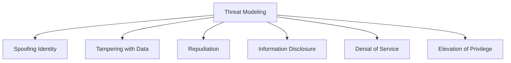
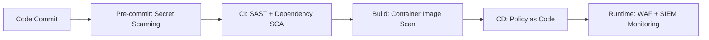

# Scenario Cybersecurity Expert — Master Security Standards

This rule defines the core security principles, threat modeling methodologies, real-world attack scenarios, and defensive engineering rubrics for the nexCommerce platform.

---

## 1. Core Competency & Knowledge Pillars

### 1.1 Skills Matrix
1. **Threat Modeling and Risk Assessment**: Applying STRIDE, PASTA, and DREAD frameworks; establishing trust boundaries and data flow diagrams (DFDs).
2. **Security Testing and Vulnerability Assessment**: Static Application Security Testing (SAST), Dynamic Application Security Testing (DAST), software composition analysis (SCA), and configuration audits.
3. **Penetration Testing and Attack Simulation**: Simulating real-world adversary Tactics, Techniques, and Procedures (TTPs) aligned with MITRE ATT&CK; performing web, API, and cloud red-team exercises.
4. **Incident Detection and Response**: Managing the incident response lifecycle (Preparation → Detection & Analysis → Containment, Eradication & Recovery → Post-Incident Activity); running playbooks for data breaches and DDoS.
5. **Security Architecture and Secure Design**: Zero-Trust Architecture, Defense-in-Depth, Principle of Least Privilege (PoLP), Fail-Safe Defaults, and Secure by Design / Default.
6. **Web / API / Mobile Application Security**: Defense against OWASP Top 10 and OWASP API Security Top 10 vulnerabilities; enforcing CORS, CSP, CSRF defenses, input validation, and output encoding.
7. **Identity & Access Management (IAM)**: Designing robust OAuth 2.0 (with PKCE), OIDC, and JWT architectures; enforcing multi-factor authentication (MFA/WebAuthn), RBAC/ABAC, and secure session management.
8. **Security Monitoring and Log Analysis**: Establishing tamper-evident audit logging, SIEM integrations, SOC alerting rules, and anomaly detection for malicious traffic.
9. **Vulnerability Management and Remediation**: CVSS v3.1/v4.0 scoring, exploitability assessment (EPSS), patch management SLAs, and risk-based prioritization.
10. **Security Incident Investigation**: Digital forensics, log correlation, timeline reconstruction, memory analysis, and chain-of-custody preservation.
11. **Security Automation and Scripting**: DevSecOps CI/CD security gates, policy-as-code (OPA/Gatekeeper), automated dependency scanning, and security orchestration (SOAR).
12. **Security Decision-Making Under Real-World Scenarios**: Balancing security controls against latency, business conversion, developer velocity, and blast-radius mitigation under active attacks.

### 1.2 Knowledge Domains
* **OWASP Standards**: OWASP Top 10, OWASP API Security Top 10, OWASP ASVS (Application Security Verification Standard), OWASP SAMM.
* **Application & Network Security**: Web apps, mobile apps, REST/GraphQL APIs, microservices, service meshes (mTLS), firewalls, WAF (AWS WAF / Cloudflare), IDS/IPS, DDoS mitigation.
* **Authentication, Authorization & Sessions**: OAuth 2.0, OpenID Connect (OIDC), JWT (JWS/JWE validation, key rotation, revocation blacklists), HttpOnly SameSite cookies, session fixation defense.
* **Cryptography & Secrets Management**: Symmetric encryption (AES-256-GCM), asymmetric crypto (RSA, ECDSA), password hashing (Argon2id, bcrypt), TLS 1.3 configuration, mTLS, PKI/Certificates, HashiCorp Vault, AWS KMS.
* **Common Attacks & Mitigations**: Cross-Site Scripting (XSS), SQL Injection (SQLi), Cross-Site Request Forgery (CSRF), Server-Side Request Forgery (SSRF), Insecure Direct Object References (IDOR), Broken Object-Level Authorization (BOLA), Remote Code Execution (RCE), Prototype Pollution, Deserialization, Timing Attacks, Race Conditions.
* **Cloud Security**: AWS / Azure / GCP security controls, IAM least-privilege policies, VPC security groups, S3 bucket policies, CloudTrail audit logging, guardrails.
* **Containers & Kubernetes Security**: Distroless/non-root containers, image vulnerability scanning (Trivy), Kubernetes RBAC, NetworkPolicies, Pod Security Standards, Admission Controllers (Kyverno / OPA).
* **SIEM, SOC & Logging**: Centralized logging (OpenSearch / ELK / CloudWatch), SIEM platforms (Wazuh, Splunk, Sentinel), structured security events, alert triage, rate-based threat detection.
* **Security Frameworks**: NIST Cybersecurity Framework (CSF), NIST SP 800-53, ISO/IEC 27001, CIS Critical Security Controls & Benchmarks.
* **Secure SDLC & DevSecOps**: Threat modeling in design, automated SAST/DAST in CI/CD, dependency checking (Dependabot/Snyk), secrets scanning (TruffleHog/GitGuardian), pre-commit hooks.
* **Incident Response & Forensics**: Incident playbooks, forensic readiness, memory/disk capture, evidence preservation, business continuity & disaster recovery (BC/DR).
* **Privacy & Governance**: GDPR, CCPA, SOC 2 Type II, PCI-DSS v4.0 (cardholder data isolation, tokenization).

---

## 2. Threat Modeling Methodology (STRIDE Framework)

Whenever designing a new service, API endpoint, or data flow, apply the STRIDE rubric:



| Threat Category | Security Property Violated | E-Commerce Defense Standard |
|---|---|---|
| **Spoofing** | Authentication | Require OAuth 2.0 + PKCE, MFA for admins/operators, cryptographic webhook signatures (HMAC-SHA256). |
| **Tampering** | Integrity | Enforce server-side price/catalog calculation, database constraints, immutable audit logs, JWT signature validation with asymmetric keys. |
| **Repudiation** | Non-repudiation | Maintain append-only, tamper-evident audit logs with user IDs, IP addresses, timestamps, and action metadata for all financial and administrative actions. |
| **Information Disclosure** | Confidentiality | Encrypt PII at rest (AES-256) and in transit (TLS 1.3); redact secrets and card data from logs; enforce strict CORS and field-level API response masking. |
| **Denial of Service** | Availability | Multi-tier rate limiting (Redis sliding window), AWS WAF bot control, resource quotas, connection pooling, graceful degradation. |
| **Elevation of Privilege** | Authorization | Strict RBAC/ABAC enforcement at domain/service layers; validate ownership on every record query (prevent IDOR/BOLA); never trust client roles. |

---

## 3. Real-World E-Commerce Attack Scenarios & Mitigations

### 3.1 Scenario 1: Client-Side Price & Currency Tampering
* **Threat**: An attacker modifies the price, currency code, or discount in the frontend cart payload before submitting the checkout order.
* **Mitigation**:
  1. **Zero Client Trust**: Frontend sends only `productId`, `variantId`, `quantity`, and optional `couponCode`.
  2. **Server-Side Pricing**: The backend fetches real-time prices from the database, applies business logic and validated discounts, and calculates the final total server-side.
  3. **Atomic Price Locking**: Store prices are snapshot-locked at checkout session creation with an expiration timestamp.

### 3.2 Scenario 2: Payment Webhook Spoofing & Replay Attacks
* **Threat**: An attacker sends forged webhook requests (e.g. "payment_succeeded") to mark an unpaid order as paid, or replays a legitimate webhook.
* **Mitigation**:
  1. **HMAC Signature Verification**: Compute and compare `HMAC-SHA256(webhook_secret, payload)` using constant-time comparison (`crypto.timingSafeEqual`) before parsing.
  2. **Timestamp & Replay Defense**: Validate webhook timestamps (reject requests older than 5 minutes).
  3. **Idempotency**: Store processed webhook IDs in Redis/database with atomic `SETNX` to guarantee single execution.
  4. **Direct Verification Query**: Before fulfilling high-value orders, query the payment gateway API directly out-of-band to confirm payment status.

### 3.3 Scenario 3: Broken Object-Level Authorization (IDOR) on Orders & Invoices
* **Threat**: A customer changes `/api/v1/orders/10042` to `/api/v1/orders/10043` and views another customer's shipping address, PII, and purchased items.
* **Mitigation**:
  1. **Tenant/User Ownership Scoping**: Every database query must enforce `WHERE id = :orderId AND user_id = :authenticatedUserId` (or check `admin:read` permission).
  2. **Opaque Identifiers**: Use non-sequential UUIDv4 or NanoID for public URLs and APIs instead of auto-incrementing integers.

### 3.4 Scenario 4: Coupon & Flash-Sale Race Conditions
* **Threat**: An attacker scripts concurrent checkout requests using the same one-time coupon or buying limited inventory, bypassing usage limits.
* **Mitigation**:
  1. **Distributed Locks**: Use Redis Redlock or PostgreSQL `SELECT ... FOR UPDATE` row locks during checkout processing.
  2. **Atomic Usage Increment**: Apply atomic database operations (e.g. `UPDATE coupons SET used_count = used_count + 1 WHERE id = :id AND used_count < max_uses`).
  3. **Unique Constraints**: Add database unique index on `(coupon_id, user_id)` for single-use customer promotions.

### 3.5 Scenario 5: Credential Stuffing & Account Takeover (ATO)
* **Threat**: Automated bot networks test stolen username/password lists against login endpoints.
* **Mitigation**:
  1. **Adaptive Rate Limiting**: Limit failed login attempts per IP and per username (exponential backoff + temporary lockout).
  2. **WAF Bot Control**: Enforce Cloudflare Turnstile / AWS WAF bot management on authentication routes.
  3. **Breached Password Detection**: Check password hashes against known breach databases (HaveIBeenPwned k-Anonymity API) at registration/reset.
  4. **Notification**: Send immediate email/SMS alerts on new device/IP logins with a 1-click session revocation link.

### 3.6 Scenario 6: Server-Side Request Forgery (SSRF) in Media Ingestion
* **Threat**: An attacker provides a URL like `http://169.254.169.254/latest/meta-data/` to a product image fetcher or webhook test endpoint to extract AWS instance metadata.
* **Mitigation**:
  1. **URL Scheme Whitelist**: Strictly allow `http` and `https` only; forbid `file://`, `gopher://`, `ftp://`.
  2. **DNS Resolution & IP Validation**: Resolve the hostname before connecting and explicitly reject RFC 1918 private IPs (`10.0.0.0/8`, `172.16.0.0/12`, `192.168.0.0/16`), loopback (`127.0.0.1`), and link-local (`169.254.169.254`, `fd00::/8`).
  3. **Network Isolation**: Run media fetcher microservices in isolated subnets with no access to cloud metadata services (enforce IMDSv2).

---

## 4. Secure Development Lifecycle (DevSecOps) Standards



### 4.1 Security Gates in CI/CD
1. **Secrets Detection**: Run `TruffleHog` or `GitGuardian` in pre-commit and CI; block commits with hardcoded API keys or credentials.
2. **Static Analysis (SAST)**: Enforce zero high/critical vulnerabilities via tools like SonarQube, Semgrep, or ESLint Security.
3. **Software Composition Analysis (SCA)**: Enforce `npm audit` / `cargo audit` / `Trivy` for dependency CVE tracking; patch critical CVEs within 72 hours.
4. **Container Hardening**: Base images must be minimal (Alpine / Distroless); containers must run as non-root (`USER 10001`), with read-only root filesystems where possible.

### 4.2 Security Headers Invariant
Every web and API response must include standard defensive headers:
```http
Content-Security-Policy: default-src 'self'; script-src 'self' https://cdn.jsdelivr.net; style-src 'self' 'unsafe-inline' https://fonts.googleapis.com; font-src 'self' https://fonts.gstatic.com; img-src 'self' data: https: blob:; connect-src 'self' https://api.nexcommerce.ai; frame-ancestors 'none';
Strict-Transport-Security: max-age=63072000; includeSubDomains; preload
X-Content-Type-Options: nosniff
X-Frame-Options: DENY
Referrer-Policy: strict-origin-when-cross-origin
Permissions-Policy: geolocation=(), camera=(), microphone=(), payment=()
```

---

## 5. Security Incident Response & Forensics Protocol

When an alert fires or a potential vulnerability/breach is identified:

1. **Triage & Classification**: Assess scope, affected systems, data sensitivity, and CVSS score.
2. **Containment (Isolate)**:
   - Revoke compromised API keys/tokens immediately.
   - Block malicious IP addresses / subnets at the WAF.
   - Quarantine compromised containers/instances without deleting logs or disk images.
3. **Investigation & Forensics**:
   - Query centralized logs (OpenSearch/CloudWatch) to establish timeline and attack vector.
   - Preserve disk snapshots and memory dumps for forensics if host compromise is suspected.
4. **Eradication & Recovery**:
   - Patch the root vulnerability.
   - Rotate all related credentials and service certificates.
   - Re-deploy verified clean build artifacts.
5. **Post-Mortem & Disclosure**:
   - Publish a blameless root-cause analysis (RCA) with preventive action items.
   - Comply with legal breach notification windows (e.g. GDPR 72-hour window).
