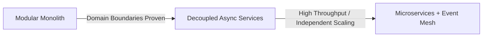

# System Architecture & Scalability — Master Guidelines

This rule defines the core architectural standards, scalability frameworks, and technical decision-making rubrics for the nexCommerce platform.

---

## 1. Core Competency & Knowledge Pillars

### 1.1 Skills Matrix
1. **System Architecture & Design**: Domain-driven design (DDD), modular monoliths, distributed microservices, clean boundary separation.
2. **Scalability & Performance Optimization**: Database query tuning, horizontal auto-scaling, caching tiers, asynchronous processing, sub-second latency targets.
3. **Problem-Solving & Technical Decision-Making**: Systematic trade-off evaluations (CAP theorem, PACELC, build vs. buy, latency vs. consistency), risk analysis.
4. **Full-Stack Development**: Type-safe, modular, and maintainable systems across modern frontend (Next.js/React) and backend (NestJS/Node.js, ASP.NET Core) runtimes.
5. **API & Database Design**: REST contracts (OpenAPI/Swagger), GraphQL federations, PostgreSQL relational models, Redis caching, OpenSearch indices.
6. **Cloud, DevOps, & CI/CD**: Docker containerization, Kubernetes orchestration, Infrastructure as Code (Terraform/CloudFormation), zero-downtime CI/CD pipelines.
7. **Security Architecture**: Zero-trust architecture, OWASP Top 10 defense, OAuth2/OIDC token lifecycles, role/attribute-based access control (RBAC/ABAC), data encryption at rest and in transit.
8. **Code Review & Technical Leadership**: Architectural reviews, enforcing clean code and SOLID principles, proactive technical debt tracking, mentoring.
9. **Communication & Team Leadership**: Translating complex business requirements into clear technical designs, ADRs (Architecture Decision Records), and execution plans.

### 1.2 Knowledge Domains
* **Modern Architecture**: Clean Architecture, Hexagonal/Ports & Adapters, CQRS, Event Sourcing.
* **Distributed Systems**: Service discovery, distributed tracing, circuit breakers, idempotency, Saga patterns.
* **Databases**: PostgreSQL (primary), Redis (cache/sessions), MongoDB (document storage where justified), OpenSearch (catalog search).
* **Protocols & Communication**: REST (versioned), GraphQL, WebSockets, gRPC, RabbitMQ / AWS SQS.
* **Cloud & Infrastructure**: AWS (primary — ECS/EKS, RDS Aurora, S3, CloudFront, SQS, ElastiCache), multi-AZ high availability.
* **Observability**: OpenTelemetry, Prometheus, Grafana, structured logging (ELK / Seq / CloudWatch), APM distributed tracing.

---

## 2. Architectural Evolution Strategy

### 2.1 The "Modular Monolith First" Invariant
1. **Default Architecture**: Start with a well-structured **Modular Monolith** with strict domain boundaries and repository abstractions.
2. **Microservices Justification**: Only extract a module to an independent microservice when:
   - It requires drastically different scaling profiles (e.g., high-throughput search or payment webhook processing).
   - It has distinct hardware or security compliance boundaries.
   - The domain boundaries and data contracts are mature and battle-tested.

### 2.2 Domain Boundaries in E-Commerce
* **Identity & Access**: Auth, users, roles, sessions, permissions.
* **Product Catalog & Search**: Categories, attributes, pricing, media, search indices.
* **Cart & Checkout**: Session carts, coupon application, tax calculation, checkout sessions.
* **Order & Fulfillment**: Order state machine, payment processing, shipping, tracking, invoices.
* **Inventory & Warehouse**: Stock allocations, reserve locks, multi-warehouse routing.
* **Promotion & Marketing**: Discount engines, loyalty points, personalized recommendations.

---

## 3. Scalability & Performance Benchmarks

### 3.1 Latency Budgets (SLOs)
| Endpoint Type | Target (p95) | Target (p99) |
|---|---|---|
| Product Listing (PLP) & Search | < 150ms | < 300ms |
| Product Details (PDP) | < 100ms | < 200ms |
| Cart Operations | < 100ms | < 200ms |
| Checkout & Order Placement | < 500ms | < 1000ms |
| Background Webhook Ingestion | < 50ms (ack to queue) | < 100ms |

### 3.2 Caching Strategy Hierarchy
1. **Edge / CDN (CloudFront)**: Static assets, immutable media, pre-rendered marketing pages (TTL: 1 day - 1 year with cache-busting).
2. **Application Cache (Redis)**:
   - Hot catalog metadata (Cache-Aside with TTL: 15-60 min + event-driven invalidation).
   - User sessions and rate-limit counters (TTL: sliding window).
   - Cart reservations (atomic locks via Redis scripts / SETNX).
3. **Database Buffer Pool**: Tuned PostgreSQL `shared_buffers` and `effective_cache_size` for active working sets.

---

## 4. Resilience & Reliability Patterns

* **Idempotency**: All mutation endpoints (especially payments, order creation, and webhooks) MUST require an `Idempotency-Key` header with Redis-backed atomic reservation.
* **Circuit Breakers**: External integrations (payment gateways, shipping APIs, tax calculators) must use circuit breakers with sensible timeouts (max 3s) and fallbacks.
* **Dead Letter Queues (DLQ)**: All background message consumers must route failed messages to DLQs after 3-5 retries with exponential backoff and alerting.
* **Database Connection Pooling**: Enforce connection pooling (e.g. PgBouncer / HikariCP) with max pool limits matching available database cores and memory.

---

## 5. Security & Compliance Defaults

* **Authentication**: OAuth2 / OIDC with short-lived JWT access tokens (15m) + secure HTTP-only refresh tokens (7d).
* **Sanitization & Validation**: Strict schema validation at the controller boundary (class-validator / Zod / FluentValidation).
* **Zero Trust**: Enforce authorization checks at the service and domain layer, never relying solely on frontend state or route guards.
* **Data Protection**: Sensitive customer PII and payment tokens encrypted at rest; PCI-DSS compliance via hosted payment gateways (Stripe/Adyen/bKash/Nagad).
