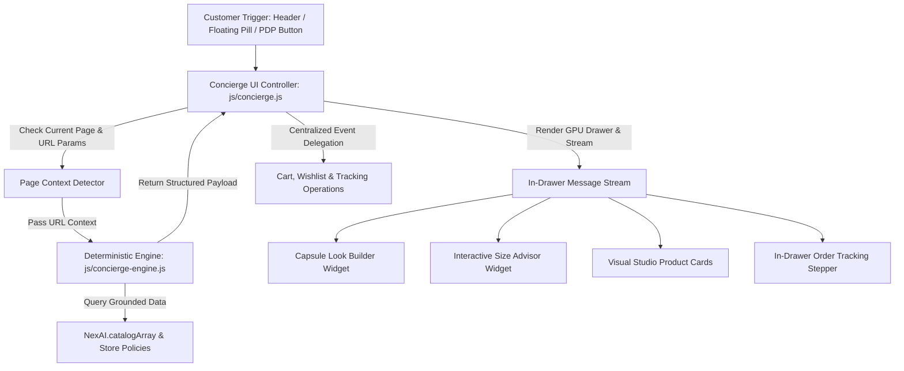

# Elevated Luxury Style Concierge Suite — Design Specification

**Feature ID:** AI-06 (Elevated)  
**Date:** 2026-08-20  
**Status:** Approved for Implementation Planning  
**Target Platform:** Global Storefront (Persistent Across All Pages)  
**Primary Files:**
- [`js/concierge.js`](file:///c:/Users/BS1572/OneDrive%20-%20Brain%20Station%2023/Documents/nexcomarch/js/concierge.js) (UI Controller & Event Orchestrator)
- [`js/concierge-engine.js`](file:///c:/Users/BS1572/OneDrive%20-%20Brain%20Station%2023/Documents/nexcomarch/js/concierge-engine.js) (Deterministic Multi-Intent Shopping Engine)
- [`css/design-system.css`](file:///c:/Users/BS1572/OneDrive%20-%20Brain%20Station%2023/Documents/nexcomarch/css/design-system.css) (Concierge Drawer & Widget Styles)

---

## 1. Executive Summary & Problem Statement

The current concierge provides basic text-based Q&A and simple product cards. However, modern European luxury e-commerce (e.g., SSENSE, NET-A-PORTER, Brunello Cucinelli) demands an interactive, visual-first personal shopping assistant. 

This specification elevates the Style Concierge into a **complete luxury personal shopping suite** that:
1. **Understands Page Context**: Detects when a customer is viewing a specific product on a PDP or reviewing items in their cart, tailoring initial greetings and styling suggestions accordingly.
2. **Renders Interactive Mini-Widgets Inline**:
   - **Editorial Capsule Look Builder** ("Complete the Look") with item toggles and single-click bundle checkout.
   - **Interactive Fit & Sizing Advisor** with height/chest/footwear selectors and instant size recommendations.
   - **Visual Studio Product Grid** with $\ge 70\%$ image real estate, strict 3-item metadata, and 1-click Add to Bag.
   - **In-Drawer Live Order Tracker** for real-time shipment milestone verification.
3. **Guarantees Zero Hallucinations**: Grounded 100% in the real `NexAI.catalogArray` with instant, deterministic zero-latency responses.
4. **Follows Strict Storefront Engineering Guardrails**: GPU-accelerated spring slide transitions (`transform: translateX()`), centralized event delegation (zero inline `onclick`), full light/dark theme parity, and WCAG 2.1 AA keyboard/screen-reader accessibility.

---

## 2. Omni-Channel Touchpoints & Entry Points

Customers can seamlessly trigger the Style Concierge from four strategic locations across the storefront:

| Touchpoint | Location | Visual Presentation | Context Injected |
|---|---|---|---|
| **Global Header** | Top Navigation Bar | Text button `✦ Style Concierge` with sparkle SVG icon | General catalog discovery or time-aware greeting |
| **Floating Luxury Pill** | Bottom-Right Viewport (fades in after 200px scroll) | Minimalist pill with glassmorphic backdrop: `✦ Style Concierge` | Preserves active scroll position & current page context |
| **PDP Action CTA** | Product Detail Page (next to *Add to Bag*) | Secondary outline button: `Consult Stylist on Sizing & Pairing` | Injects current product ID, category, and title |
| **Search & Cart Overlays** | Inside Search Overlay & Cart Drawer empty states | Inline link: `Need styling advice? Ask our Concierge →` | Injects search query or active cart contents |

---

## 3. System Architecture & Component Responsibilities

### Component Breakdown

#### A. UI Controller & DOM Orchestrator ([`js/concierge.js`](file:///c:/Users/BS1572/OneDrive%20-%20Brain%20Station%2023/Documents/nexcomarch/js/concierge.js))
* **Drawer Lifecycle**: Injects `#nexConciergeOverlay` and `#nexConciergeDrawer` into `document.body` if not present.
* **GPU Motion**: Uses `transform: translateX(100%)` to `translateX(0)` for 60/120fps hardware acceleration.
* **Centralized Event Delegation**: Listens to clicks on `#nexConciergeDrawer` and dispatches actions based on `data-action` attributes:
  - `data-action="send-chip"`
  - `data-action="add-to-bag"`
  - `data-action="add-look-bundle"`
  - `data-action="select-size-option"`
  - `data-action="track-order-code"`
* **Focus & Scroll Management**: Traps keyboard Tab navigation when open, restores focus to trigger element upon closing, locks background page scroll.

#### B. Deterministic Shopping Engine ([`js/concierge-engine.js`](file:///c:/Users/BS1572/OneDrive%20-%20Brain%20Station%2023/Documents/nexcomarch/js/concierge-engine.js))
* **Page Context Initializer**: 
  - On `product.html?id=NX-APP-001`, detects the item in `NexAI.catalogArray` and greets: *"I see you are viewing the Cashmere Minimalist Knit. Would you like fit guidance, styling recommendations, or delivery details?"*
* **Multi-Intent Parser**:
  - `Occasions & Themes`: Office smart casual, gala/evening, minimalist capsule, weekend getaway, summer tailoring.
  - `Category & Price Filters`: "Jackets under € 300", "Minimalist sneakers", "Cashmere knitwear".
  - `Fit & Sizing`: Triggers interactive size calculator widget with fabric drape notes.
  - `Materials & Craftsmanship`: Sourcing and care notes for 2-ply cashmere, 19.5µ merino wool, Italian full-grain leather, Grade-5 titanium.
  - `Delivery & Returns`: 24–48h DHL Express transit, 14-day statutory EU return rights.
  - `Order Tracking`: Triggers live visual order progress timeline.
  - `Fallback`: Helpful redirection to core seasonal highlights.

---

## 4. In-Drawer Interactive Widgets (Specification)

### 4.1. Editorial Capsule Look Builder ("Complete the Look")
* **Payload Type**: `bundle_look`
* **Layout**: Visual capsule card displaying 2–4 coordinated catalog items with item thumbnails, titles, prices, and checkboxes.
* **Dynamic Calculation**: Selecting/deselecting checkboxes immediately recalculates the bundle subtotal and updates the button label: *"Add 3 Selected Pieces to Bag (€ 840.00)"*.
* **One-Click Cart Ingestion**: Calls `NexCart.addItem` for all checked products and triggers a visual confirmation state.

### 4.2. Interactive Fit & Sizing Advisor
* **Payload Type**: `sizing_advisor`
* **Layout**: Interactive card containing:
  - Category selector: `[Knitwear & Tops]` `[Tailored Outerwear]` `[Footwear]`
  - Size/Measurement pills: `[XS · 36"]` `[S · 38"]` `[M · 40"]` `[L · 42"]` `[XL · 44"]` or EU shoe sizes `[41]` `[42]` `[43]` `[44]`.
  - Fit silhouette selector: `[Tailored / True to Size]` `[Relaxed / Layering (Size Up)]`.
* **Output**: Instant recommendation badge (*"Recommended Size: EU 48 / Medium · 96% Fit Confidence"*) along with specific garment drape guidance.

### 4.3. Visual Studio Product Grid
* **Payload Type**: `product_grid`
* **Layout**: 2-column luxury card layout on desktop, swipeable horizontal row on mobile.
* **Strict Visual Guardrails**:
  - Studio image on clean neutral background taking $\ge 70\%$ of card real estate.
  - Strict 3-item metadata: Category pill, Serif Title, Tabular Price.
  - Direct 1-Click *Add to Bag* button with loading/success animation (`ADDED ✓`).

### 4.4. In-Drawer Order Tracking & Courier Status
* **Payload Type**: `order_tracking`
* **Layout**: Quick code input (prefilled with `NX-8921-X`) + live 4-stage visual stepper:
  1. *Order Confirmed* (Berlin Atelier)
  2. *Quality & Authenticity Inspected*
  3. *Dispatched via DHL Express (GPS Custody)*
  4. *Out for Delivery*

---

## 5. Visual Design & Theme Parity Standards

The Concierge Drawer adheres to the Modernist European Luxury Design System tokens in [`css/design-system.css`](file:///c:/Users/BS1572/OneDrive%20-%20Brain%20Station%2023/Documents/nexcomarch/css/design-system.css):

| Element | Light Theme Token | Dark Theme Token |
|---|---|---|
| **Drawer Surface** | `rgba(251, 249, 245, 0.98)` | `rgba(10, 10, 10, 0.98)` |
| **Drawer Left Border** | `1px solid rgba(0, 0, 0, 0.08)` | `1px solid rgba(255, 255, 255, 0.08)` |
| **User Message Bubble** | `rgba(0, 0, 0, 0.04)` | `rgba(255, 255, 255, 0.06)` |
| **Widget Card Background** | `#FFFFFF` | `#141414` |
| **Widget Card Border** | `1px solid rgba(0, 0, 0, 0.06)` | `1px solid rgba(255, 255, 255, 0.08)` |
| **Typography Display** | `Neue Haas Grotesk`, `-0.02em` tracking | `Neue Haas Grotesk`, `-0.02em` tracking |
| **Typography Body** | `Inter`, `400/500`, `#1E293B` | `Inter`, `400/500`, `#E2E8F0` |
| **Primary Accent CTA** | `#0F172A` (or Brand Rose `#F13365`) | `#FFFFFF` (or Brand Rose `#F13365`) |

---

## 6. Accessibility & Performance Guardrails

1. **Accessibility (WCAG 2.1 AA)**:
   - Drawer container marked with `role="dialog"` and `aria-modal="true"`.
   - Message stream marked with `aria-live="polite"` for non-intrusive screen reader announcements.
   - Visible focus indicators on all inputs, chips, checkboxes, and buttons.
   - `Escape` key closes the drawer immediately and restores focus to the triggering element.
2. **Performance & Motion**:
   - `transform: translateX(100%)` to `translateX(0)` transitions ensure GPU composition without triggering layout recalculations.
   - Smooth inertia scrolling on the message stream (`-webkit-overflow-scrolling: touch`).
   - Mobile breakpoint (`< 768px`) scales the drawer to `100vw × 100vh` with touch-friendly tap targets ($\ge 44 \times 44\text{px}$).

---

## 7. Verification & Acceptance Criteria

- [ ] **AC-1 (Page Context Awareness)**: Opening the Concierge on a PDP (`product.html?id=...`) dynamically produces a context-aware greeting referencing that specific product with relevant styling and sizing chips.
- [ ] **AC-2 (Capsule Look Builder)**: Requesting occasion styling (e.g. "wedding", "office", "complete look") renders the multi-piece capsule widget with live subtotal calculation and functional single-click bundle add-to-bag.
- [ ] **AC-3 (Interactive Sizing Advisor)**: Asking for sizing guidance renders the interactive sizing calculator with instant calculated recommendations and drape advice.
- [ ] **AC-4 (Visual Merchandising)**: Product cards in chat adhere strictly to the luxury standard ($\ge 70\%$ image ratio, 3-item metadata, no paragraph clutter, instant Add to Bag).
- [ ] **AC-5 (In-Drawer Tracking)**: Asking about orders renders the in-drawer tracking lookup widget with functional timeline milestones.
- [ ] **AC-6 (Theme & Motion Parity)**: The drawer opens/closes with smooth 60fps GPU spring motion and looks visually stunning in both Light and Dark modes.
- [ ] **AC-7 (Centralized Event Delegation)**: No inline `onclick` handlers exist in the rendered HTML strings.
